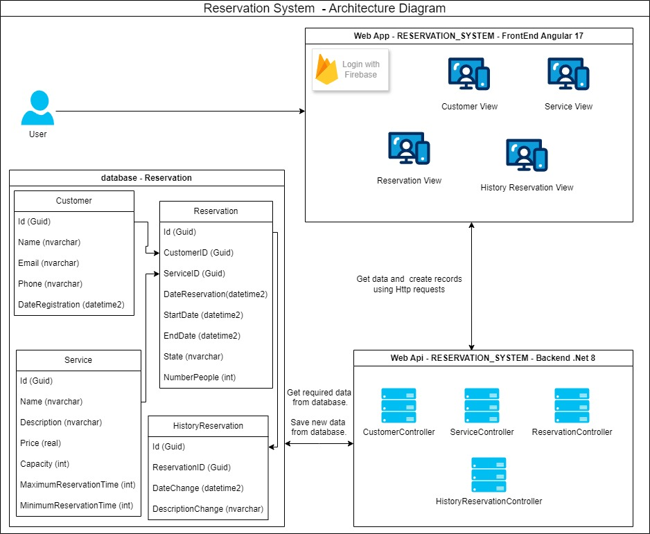

# ReservationSystem

## Descripción General

Este documento proporciona una visión general del desarrollo realizado tanto en el **FrontEnd** como en el **BackEnd** del "Sistema de Reservas". A continuación, se detallan las consideraciones necesarias para poner en funcionamiento la aplicación, incluyendo los pasos para configurar el entorno. Finalmente, se explica cómo ejecutar las diferentes pruebas (unitarias, de integración y de mutación) y cómo ver los resultados de la cobertura de las pruebas realizadas.

---

## Descripción FrontEnd

El **FrontEnd** se construyó usando **Angular 17**. La estructura del proyecto sigue los estándares de la industria, utilizando un enfoque modular conocido como **core-shared-feature**, lo que permite una mejor mantenibilidad, escalabilidad y reutilización del código.

### Módulo Core

Contiene funcionalidades globales y transversales que son compartidas en toda la aplicación, como:

- Servicios comunes
- Guardas
- Componentes comunes como el header

El objetivo es tener elementos transversales y de una sola instancia en la aplicación.

### Módulo Shared

Contiene elementos que son compartidos por varios módulos de la aplicación, como:

- Componentes
- Servicios
- Constantes
- Interfaces

Este módulo permite la reutilización de código agrupando elementos comunes.

### Módulo Feature

Contiene componentes o elementos específicos de la aplicación. Los módulos de **Feature** pueden utilizar características de los módulos **Shared** y **Core** cuando sea necesario.

Esta modularidad facilita la escalabilidad, permitiendo agregar nuevas características sin afectar el código existente.

### Patrones de Diseño Utilizados

Durante el desarrollo, se implementaron los siguientes patrones de diseño recomendados por Angular:

- **Singleton**: Servicios anotados con `providedIn: 'root'` son instanciados una única vez y compartidos en toda la aplicación.
- **Inyección de dependencias**: Servicios que comparten la misma información.
- **Observables y RxJS**: Para manejar eventos asíncronos.
- **Resolución de Rutas**: Al definir rutas en módulos de enrutamiento.
- **Patrón AAA (Arrange, Act, Assert)**: En pruebas.
- **Mocking**: En pruebas unitarias, para simular dependencias externas.
- **Decoradores**: Añaden funcionalidad dinámica (por ejemplo, `@Component`, `@Injectable`, `@NgModule`).

---

## Descripción BackEnd

El **BackEnd** se construyó usando **.NET 8**, aplicando la **arquitectura hexagonal** o de puertos y adaptadores, junto con **CQRS** (Command Query Responsibility Segregation) para separar responsabilidades entre consultas (Queries) y operaciones (Commands).

### Capas del BackEnd

- **API**: Contiene los controladores y endpoints de la aplicación.
- **Api.Tests**: En esta capa se encuentran todas las pruebas de integración, realizadas a la capa de Api.
- **Application**: Orquesta los servicios de dominio como Commands, Queries y Handlers.
- **Infrastructure**: Implementaciones concretas de los adaptadores, comunicación con tecnologías externas y persistencia de datos.
- **Domain**: Lógica de negocio, incluyendo entidades, objetos de valor, reglas de negocio, puertos, comandos y consultas.
- **Domain.Tests**: Contiene las pruebas unitarias de la capa de dominio.

### Patrones de Diseño Utilizados

- **Inyección de dependencias**
- **Patrón AAA (Arrange, Act, Assert)**
- **Patrón Builder**
- **CQRS**
- **Decoradores**
- **DTO (Data Transfer Object)**

---

## Configuración y Ejecución de la Aplicación

---

### Descripción FrontEnd

Para correr el **FrontEnd** con **Angular**, sigue estos pasos:

1. **Tener instalada una versión de Node 20** o compatible para Angular 17+.
2. **Clonar el repositorio.**
3. Desde la terminal, ingresa a la carpeta `RESERVATION_SYSTEM.Frontend`.
4. Ejecuta el comando:
    ```bash
    npm install
    ```
    Esto instalará las librerías necesarias.
5. Inicia la aplicación con:
    ```bash
    ng serve
    ```
6. Una vez ejecutado, abre el navegador en `http://localhost:4200` para ver la aplicación.

---

### Descripción BackEnd

Para correr el **BackEnd** en **.NET 8**, sigue estos pasos:

1. **Instalar el .NET 8 SDK** desde [aquí](https://dotnet.microsoft.com/es-es/download).
2. Tener una instancia de **SQL Server** con un usuario con permisos suficientes para crear bases de datos, por ejemplo un usuario con el rol sysadmin.
3. **Clonar el repositorio.**
4. Edita el archivo `appsettings.json` en la carpeta `RESERVATION_SYSTEM.Backend\RESERVATION_SYSTEM.Api` para ajustar la cadena de conexión a SQL Server:

    ```json
    "StringConnection": "Server=localhost\\SQLEXPRESS;Database=Reservation;User Id=hsmo;Password=12345;TrustServerCertificate=True"
    ```

5. Ejecuta las migraciones de **Entity Framework** para crear la base de datos:

    a) Instala el CLI de **EF Core**:
    ```bash
    dotnet tool install --global dotnet-ef
    ```

    b) Crea la migración desde la carpeta `RESERVATION_SYSTEM.Infrastructure`:
    ```bash
    dotnet ef migrations add Inicial --startup-project ..\RESERVATION_SYSTEM.Api\RESERVATION_SYSTEM.Api.csproj
    ```

    c) Aplica la migración y crea la base de datos:
    ```bash
    dotnet ef database update -s ..\RESERVATION_SYSTEM.Api\RESERVATION_SYSTEM.Api.csproj
    ```
    d)  La migración aplicada incluye el esquema de la base de datos con las relaciones definidas entre las tablas. Además, contiene datos semilla que proporcionan información inicial, como usuarios predeterminados de la aplicación y espacios disponibles para reservar. El sistema está diseñado para permitir la creación, edición y eliminación de usuarios y espacios adicionales según las necesidades.

6. Ejecuta la aplicación con el siguiente comando desde la raíz del proyecto:
    ```bash
    dotnet run --project .\RESERVATION_SYSTEM.Api\RESERVATION_SYSTEM.Api.csproj
    ```

    La aplicación estará disponible en el puerto `5443`.

7. Abre el navegador y valida la documentación de la API en **Swagger**:
    ```bash
    https://localhost:5443/swagger/index.html
    ```

--- 

Con lo anterior ya deberia de poder ver la aplicacion funcionando correctamente.

Como datos adicionales, a continuacion se muestra un diagrama de la arquitectura usada para desarrollar la aplicacion y la documentacion de la api que se genera con swagger.




[ver documentación de la api con swagger](./DocumentationWithSwaggerWebApi/DocumentationWithSwagger.json)


---

## Pasos para ejecutar y ver resultados de las diferentes pruebas

---

### Descripción BackEnd

---

#### Pruebas unitarias

Este tipo de pruebas (unitarias) verifican de forma aislada el funcionamiento correcto de las unidades más pequeñas del código, como funciones o métodos en la capa de negocio, donde se encuentra la logica o reglas de negocio de la aplicación, en este caso la capa "Domain", asegurando que cumplan con su propósito esperado.

para ejecutar las pruebas se debe ubicar en la ruta `RESERVATION_SYSTEM.Domain.Tests` y ejecutar el siguiente comando:

```bash
    dotnet test
```

Al final de ejecutar el comando se muestra un resumen de cuantas pruebas se ejecutaron y su estado.

---

#### Pruebas de mutación

Este tipo de pruebas evalúan la calidad de las pruebas unitarias existentes modificando deliberadamente el código fuente (introduciendo "mutantes") y verificando si las pruebas detectan estos cambios. Si las pruebas no fallan con los mutantes, indica que podrían ser insuficientes o ineficaces.

para ejecutar las pruebas se debe ubicar en la ruta `RESERVATION_SYSTEM.Domain.Tests` y ejecutar el siguiente comando:


```bash
    dotnet stryker
```

En caso de no tener instalada la herramienta de stryker, lo puede instalar con el siguiente comando:

```bash
    dotnet tool install --global dotnet-stryker
```

Al final de ejecutar las pruebas de mutación, se muestra el porcentaje de cobertura de pruebas de mutacion y se genera un informe html con el resultado de dichas pruebas.

Para el caso de esta aplicación el porcentaje de cobertura de pruebas de mutación esta por encima del 80%

---

#### Pruebas de integración

Este tipo de pruebas verifican que los módulos o componentes interactúen correctamente entre sí, asegurando que las dependencias, como bases de datos, APIs externas o servicios, funcionen de manera conjunta como se espera.

Para el caso de esta aplicación, para ejecutar las pruebas de integración se uso una base de datos en memoria, para asi, probar la interación entre las diferentes capas de la aplicación.

para ejecutar las pruebas se debe ubicar en la ruta `RESERVATION_SYSTEM.Api.Tests` y ejecutar el siguiente comando:


```bash
    dotnet test
```

Al final de ejecutar el comando se muestra un resumen de cuantas pruebas se ejecutaron y su estado.


---

### Descripción FrontEnd

---

#### Pruebas unitarias

Las pruebas unitarias en Angular verifican, de manera aislada, el correcto funcionamiento de componentes, servicios, directivas u otros elementos del código. Sirven para garantizar que cada unidad cumpla con su propósito esperado sin depender de otras partes de la aplicación.


para ejecutar las pruebas se debe ubicar en la carpeta raiz del proyecto del FrontEnd de la aplicación y ejecutar el siguiente comando:


```bash
    ng test --code-coverage --watch
```

Al final de ejecutar el comando se muestra un resumen de cuantas pruebas se ejecutaron y su estado.


---